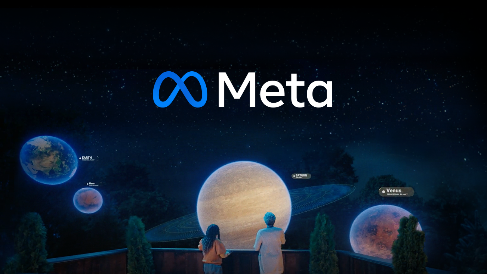

## Hey, welcome to Meta Open Source 👋

We believe open source brings out the best in both technology and people. Since the early days of Facebook, we've shared the tools we build internally with the world — and the world has made them better. From social infrastructure to AI research, the projects that power Meta are yours to use, contribute to, and build on.

### 🌍 Why we open source

We think open source software is bigger than any one company, and we've structured our entire engineering culture around that idea:

- **Collaboration** — Developers everywhere working together toward common goals produce better outcomes than any team working alone.
- **Community** — Diverse contributors bring diverse perspectives. The best technology is built when everyone has a seat at the table.
- **Technology** — Open platforms become the foundations of entire industries. We want to build those foundations in the open.

### 🚀 Projects you might know

Some of the tools used by billions of people every day started right here:

- [**React**](https://github.com/facebook/react) — The library for building user interfaces across the web and native platforms
- [**PyTorch**](https://github.com/pytorch/pytorch) — The open source machine learning framework powering AI research worldwide
- [**Llama**](https://github.com/meta-llama/llama-models) — Meta's family of open large language models
- [**Docusaurus**](https://github.com/facebook/docusaurus) — Build beautiful documentation websites quickly and easily
- [**Jest**](https://github.com/jestjs/jest) — Delightful JavaScript testing with a focus on simplicity
- [**RocksDB**](https://github.com/facebook/rocksdb) — A high-performance embeddable key-value store for fast storage
- [**Hermes**](https://github.com/facebook/hermes) — A JavaScript engine optimized for running React Native apps
- [**Buck2**](https://github.com/facebook/buck2) — A fast, scalable build system used across Meta's monorepo

[Explore all projects →](https://opensource.fb.com/projects)

### 🤝 Get involved

Open source only works when people contribute. Here's how to dive in:

- Browse our repositories and look for [`good first issue`](https://github.com/search?q=org%3Afacebook+label%3A%22good+first+issue%22+state%3Aopen&type=issues) labels
- Read the [Meta Engineering Blog](https://engineering.fb.com) for deep dives on the problems we're solving
- Check out the [Meta Open Source showcase](https://opensource.fb.com/showcase) to see who's building with our tools
- Follow us on [GitHub](https://github.com/facebook) for new releases and announcements

Interested in building open source as your day job? [Explore careers at Meta](https://www.metacareers.com).

### 📖 How we work

Every project we open source comes with a commitment: we maintain it, we listen to the community, and we hold ourselves to the same standards we'd want from any dependency we rely on. All Meta open source projects follow our [Code of Conduct](https://opensource.fb.com/code-of-conduct) and are governed by our [Open Source Program Office](https://opensource.fb.com/about).

Have a question or idea? Open an issue in the relevant repository — that's where the conversation lives.

---

Learn more at [opensource.fb.com](https://opensource.fb.com)
